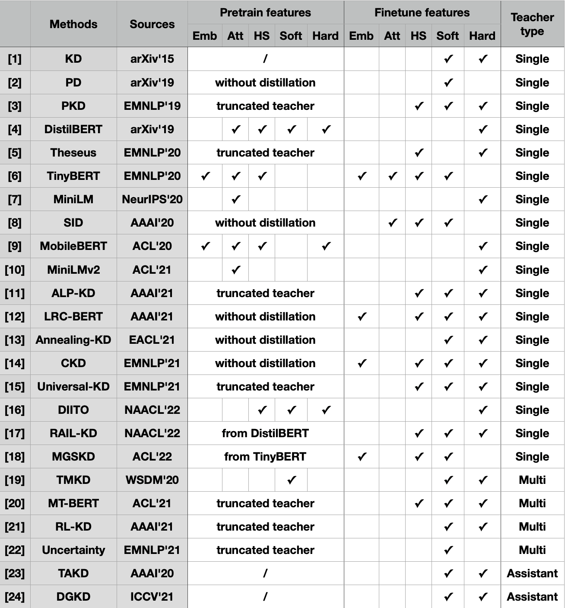
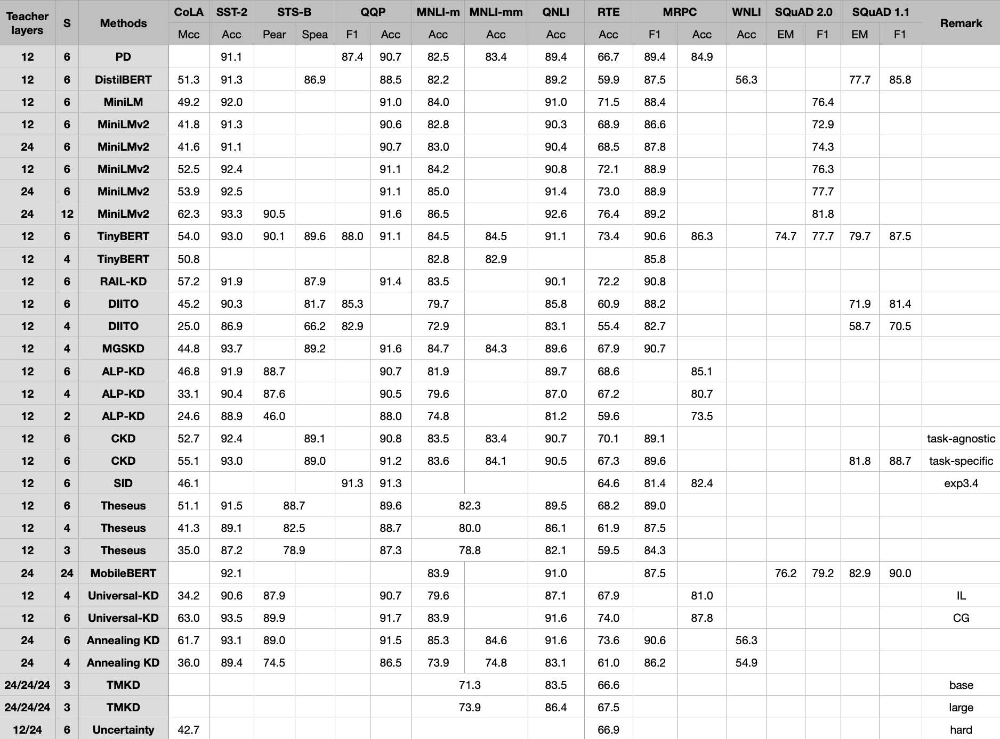
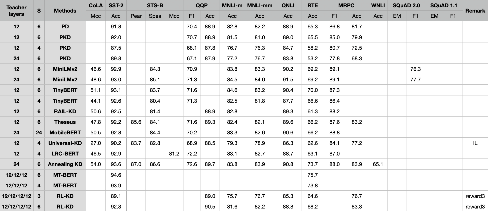

# GKD

GKD is a PyTorch-based model distillation toolkit for [General Language Model](https://github.com/THUDM/GLM).

It provides a flexible architecture to efficiently implement various language model distillation methods, while allowing the use of a combination of these methods.

We have introduced techniques such as model parallelism ([Megatron-LM](https://github.com/NVIDIA/Megatron-LM)) and ZeRO ([DeepSpeed](https://github.com/microsoft/DeepSpeed)) in the toolkit to make it efficient for distilling very large models.

## Distillation Methods
We briefly summarize here the 24 model distillation methods that have been implemented by the toolkit.



```
[1] Geoffrey E. Hinton, Oriol Vinyals, Jeffrey Dean. Distilling the Knowledge in a Neural Network[J]. CoRR, 2015, abs/1503.02531.
[2] Iulia Turc, Ming-Wei Chang, Kenton Lee, Kristina Toutanova. Well-Read Students Learn Better - The Impact of Student Initialization on Knowledge Distillation[J]. CoRR, 2019, abs/1908.08962.
[3] Siqi Sun, Yu Cheng. Zhe Gan, Jingjing Liu. Patient Knowledge Distillation for BERT Model Compression[C]// EMNLP. 2019: 4322-4331.
[4] Victor Sanh, Lysandre Debut, Julien Chaumond, Thomas Wolf. DistilBERT, a distilled version of BERT - smaller, faster, cheaper and lighter[J]. CoRR, 2019, abs/1910.01108.
[5] Canwen Xu, Wangchunshu Zhou, Tao Ge, Furu Wei, Ming Zhou. BERT-of-Theseus - Compressing BERT by Progressive Module Replacing[C]// EMNLP. 2020: 7859-7869.
[6] Xiaoqi Jiao, Yichun Yin, Lifeng Shang, Xin Jiang. Xiao Chen, Linlin Li, Fang Wang. Qun Liu. TinyBERT - Distilling BERT for Natural Language Understanding[C]// EMNLP. 2020: 4163-4174.
[7] Wenhui Wang, Furu Wei, Li Dong. Hangbo Bao, Nan Yang. Ming Zhou. MiniLM - Deep Self-Attention Distillation for Task-Agnostic Compression of Pre-Trained Transformers[C]// NeurIPS. 2020.
[8] Gustavo Aguilar, Yuan Ling, Yu Zhang, Benjamin Yao, Xing Fan, Chenlei Guo. Knowledge Distillation from Internal Representations[C]// AAAI. 2020: 7350-7357.
[9] Zhiqing Sun, Hongkun Yu, Xiaodan Song, Renjie Liu, Yiming Yang, Denny Zhou. MobileBERT - a Compact Task-Agnostic BERT for Resource-Limited Devices[C]// ACL. 2020: 2158-2170.
[10] Wenhui Wang, Hangbo Bao, Shaohan Huang, Li Dong. Furu Wei. MiniLMv2 - Multi-Head Self-Attention Relation Distillation for Compressing Pretrained Transformers[C]// ACL. 2021: 2140-2151.
[11] Peyman Passban, Yimeng Wu, Mehdi Rezagholizadeh, Qun Liu. ALP-KD - Attention-Based Layer Projection for Knowledge Distillation[C]// AAAI. 2021: 13657-13665.
[12] Hao Fu, Shaojun Zhou, Qihong Yang, Junjie Tang, Guiquan Liu, Kaikui Liu, Xiaolong Li. LRC-BERT - Latent-representation Contrastive Knowledge Distillation for Natural Language Understanding[C]// AAAI. 2021: 12830-12838.
[13] Aref Jafari, Mehdi Rezagholizadeh, Pranav Sharma, Ali Ghodsi. Annealing Knowledge Distillation[C]// EACL. 2021.
[14] Geondo Park, Gyeongman Kim, Eunho Yang. Distilling Linguistic Context for Language Model Compression[C]// EMNLP. 2021: 364-378.
[15] Yimeng Wu, Mehdi Rezagholizadeh, Abbas Ghaddar, Md. Akmal Haidar, Ali Ghodsi. Universal-KD - Attention-based Output-Grounded Intermediate Layer Knowledge Distillation[C]// EMNLP. 2021: 7649-7661.
[16] Zhengxuan Wu, Atticus Geiger, Joshua Rozner, Elisa Kreiss, Hanson Lu, Thomas Icard, Christopher Potts, Noah D. Goodman. Causal Distillation for Language Models[C]// NAACL. 2022: 4288-4295.
[17] Md. Akmal Haidar, Nithin Anchuri, Mehdi Rezagholizadeh, Abbas Ghaddar, Philippe Langlais, Pascal Poupart. RAIL-KD: RAndom Intermediate Layer Mapping for Knowledge Distillation[C]// NAACL. 2022: 1389-1400.
[18] Chang Liu, Chongyang Tao, Jiazhan Feng, Dongyan Zhao. Multi-Granularity Structural Knowledge Distillation for Language Model Compression[C]// ACL. 2022: 1001-1011.
[19] Ze Yang, Linjun Shou, Ming Gong, Wutao Lin, Daxin Jiang. Model Compression with Two-stage Multi-teacher Knowledge Distillation for Web Question Answering System[C]// WSDM. 2020: 690-698.
[20] Chuhan Wu, Fangzhao Wu, Yongfeng Huang. One Teacher is Enough? Pre-trained Language Model Distillation from Multiple Teachers[C]// ACL. 2021: 4408-4413.
[21] Fei Yuan, Linjun Shou, Jian Pei, Wutao Lin, Ming Gong, Yan Fu, Daxin Jiang. Reinforced Multi-Teacher Selection for Knowledge Distillation[C]// AAAI. 2021: 14284-14291.
[22] Lei Li, Yankai Lin, Shuhuai Ren, Peng Li, Jie Zhou, Xu Sun. Dynamic Knowledge Distillation for Pre-trained Language Models[C]// EMNLP. 2021: 379-389.
[23] Seyed-Iman Mirzadeh, Mehrdad Farajtabar, Ang Li, Nir Levine, Akihiro Matsukawa, Hassan Ghasemzadeh. Improved Knowledge Distillation via Teacher Assistant[C]// AAAI. 2020: 5191-5198.
[24] Wonchul Son, Jaemin Na, Junyong Choi, Wonjun Hwang. Densely Guided Knowledge Distillation using Multiple Teacher Assistants[C]// ICCV. 2021: 9375-9384.
```

## Results
### The results of our toolkit on GLM
#### Dev set
...
### The results of the original papers on BERT
#### Dev set


#### Test set


## Get Started
### Docker Image
We prepare a docker image based on Python 3.8.13, PyTorch 1.9.1, and CUDA 11.1. You can pull the pre-built images from Docker Hub and run with docker v19.03+
  ```shell
  docker run --gpus all --rm -it --ipc=host aitsc/glm:v1.5
  ```
### Manual Installation
```shell
git clone https://github.com/THUDM/GKD
cd GKD
conda create -n GLM python=3.8
conda activate GLM
pip install torch==1.9.1+cu111 torchvision==0.10.1+cu111 torchaudio==0.9.1 -f https://download.pytorch.org/whl/torch_stable.html
pip install -r requirements.txt
git clone https://github.com/NVIDIA/apex
cd apex
git checkout 22.04-dev
pip install -v --no-cache-dir --global-option="--cpp_ext" --global-option="--cuda_ext" ./
cd .. && rm -rf apex
```
Same as [GLM](https://github.com/THUDM/GLM#get-started).

### Model Parallelism
If your encounter the `CUDA out of memory` error, which means you GPU memory is limited, you can try the model parallelism to divide the parameters into multiple GPUs. Take the two-way model parallelism as an example. First run `change_mp.py` to divide the checkpoint:
```shell
python change_mp.py path_to_the_checkpoint 2
```
Then change `--model-parallel-size` in the command to `2`.

## Usage of existing methods
We provide commands for distilling GLM on all methods with deepspeed.

Suppose we want to distill a 12-layer teacher model to a 6-layer student model and test it on the ReCoRD dataset. We can first define 4 command prefixes that are not related to the specific method.
```shell
1. Prefix-pretrain: NCCL_DEBUG=info NCCL_IB_DISABLE=0 NCCL_NET_GDR_LEVEL=2 deepspeed --master_port=13761 --include=localhost:0,1 distill/pretrain.py --deepspeed_config=config/config_block_tiny6.json --deepspeed-activation-checkpointing --deepspeed --block-lm --num-layers=6 --hidden-size=768 --num-attention-heads=12 --max-position-embeddings=512 --tokenizer-model-type=bert-base-uncased --tokenizer-type=BertWordPieceTokenizer --fp16 --checkpoint-activations --model-parallel-size=1 --save-interval=5000 --save=../GLM/data/checkpoints/distill/tiny6 --experiment-name=test --bert-prob=1.0 --train-data=bert-base --split=949,50,1 --distributed-backend=nccl --lr-decay-style=cosine --lr-decay-iters=120000 --lr-decay-ratio=0.05 --warmup=.05 --train-iters=150000 --no-lazy-loader --resume-dataloader
2. Prefix-finetune: NCCL_DEBUG=info NCCL_IB_DISABLE=0 NCCL_NET_GDR_LEVEL=2 deepspeed --master_port=20696 --include=localhost:0 --hostfile= distill/finetune.py --finetune --cloze-eval --experiment-name=blank-tiny6-ReCoRD-test --task=ReCoRD --data-dir=../GLM/data/english_data/superglue/ReCoRD --save=../GLM/data/checkpoints/distill/tiny6/test/ft --seq-length=512 --checkpoint-activations --eval-batch-size=16 --save-epoch=100000 --block-lm --num-layers=6 --hidden-size=768 --num-attention-heads=12 --max-position-embeddings=512 --tokenizer-model-type=bert-base-uncased --tokenizer-type=BertWordPieceTokenizer --load-pretrained=../GLM/data/checkpoints/distill/tiny6/test --fp16 --lr-decay-style=linear --warmup=0.1 --weight-decay=1.0e-1 --pattern-id=0 --save-interval=10000 --log-interval=50 --eval-interval=1000 --eval-iters=100 --batch-size=8 --epochs=5 --lr=1e-5 --overwrite --deepspeed-activation-checkpointing --deepspeed --deepspeed_config=config/config_block_tiny6.json
3. Prefix-single-teacher: --teacher_load_pretrained=../GLM/data/checkpoints/pretrain/blocklm-base-blank --teacher_num_layers=12 --teacher_hidden_size=768 --teacher_num_attention_heads=12 --teacher_max_position_embeddings=512 --teacher_fp16
4. Prefix-multi-teacher: --mt_num_attention_heads=a1:a2 --mt_hidden_size=h1:h2 --mt_num_layers=l1:l2 --mt_max_position_embeddings=m1:m2 --mt_load_pretrained=p1:p2 --teacher_fp16
```
Then we can build commands of different methods.
(see [distill/readme.md](distill/readme.md) and [distill/prepare.py](distill/prepare.py) for more detailed descriptions and parameters)
### KD
1. [Prefix-finetune] [Prefix-single-teacher] --student_model=kd --distill_ft_soft --distill_ft_hard --distill_temperature=10
### PD
1. [Prefix-pretrain]
2. [Prefix-finetune] [Prefix-single-teacher] --student_model=kd --distill_ft_soft --distill_temperature=1
### TinyBERT
1. [Prefix-pretrain] [Prefix-single-teacher] --student_model=tinybert
2. [Prefix-finetune] [Prefix-single-teacher] --student_model=tinybert
3. [Prefix-finetune] [Prefix-single-teacher] --student_model=tinybert --distill_ft_soft --tinybert_wo_inter
### MiniLMv2
1. [Prefix-pretrain] [Prefix-single-teacher] --student_model=minilmv2 --minilmv2_relation_heads=48 --minilmv2_teacher_layer=12
2. [Prefix-finetune]
### MiniLM
1. [Prefix-pretrain] [Prefix-single-teacher] --student_model=minilm
2. [Prefix-finetune]
### DistilBERT
1. [Prefix-pretrain] [Prefix-single-teacher] --student_model=distilbert --distill_temperature=2 --distilbert_alpha_ce=5 --distilbert_alpha_mlm=2 --distilbert_alpha_cos=1 --distilbert_cos_mask_padding
2. [Prefix-finetune]
### PKD
1. [Prefix-finetune] [Prefix-single-teacher] --student_model=pkd --distill_ft_soft --distill_ft_soft_kl --distill_ft_hard --distill_temperature=10 --pkd_normalized_patience --pkd_alpha=0.5 --pkd_beta=100 --student_truncate_tn=0 --pkd_wo_final
### RAIL_KD
1. from DistilBERT
2. [Prefix-finetune] [Prefix-single-teacher] --student_model=rail_kd --distill_ft_soft --distill_soft_rate=0.3333 --distill_ft_hard --distill_hard_rate=0.3333 --distill_temperature=10 --rail_kd_inter_rate=0.3333 --rail_kd_layer_wise_alpha=1 --rail_kd_u=128 --rail_kd_concatenated --rail_kd_epochs=1 --rail_kd_show_hook_change
### MGSKD
1. from TinyBERT
2. [Prefix-finetune] [Prefix-single-teacher] --student_model=mgskd --mgskd_weight_sample=4 --mgskd_weight_token=1 --mgskd_weight_span=1 --mgskd_sample_level_m=3 --mgskd_triplet_k1=20 --mgskd_triplet_k2=20
3. [Prefix-finetune] [Prefix-single-teacher] --student_model=mgskd --distill_ft_soft --distill_ft_soft_kl --distill_temperature=1 --mgskd_wo_inter
### DIITO
1. [Prefix-pretrain] [Prefix-single-teacher] --student_model=diito --forward_repeat_num=1 --diito_alignment=full --diito_interchange_prop=0.3 --diito_interchange_way=consecutive --diito_interchange_max_token=-1 --diito_alpha_mlm=0.25 --diito_alpha_ce=0.25 --diito_alpha_causal_ce=0.25 --diito_alpha_cos=0.25 --diito_alpha_causal_cos=0  --distill_pt_soft --distill_pt_hard --distill_temperature=2
2. [Prefix-finetune]
### SID
1. [Prefix-pretrain]
2. [Prefix-finetune] [Prefix-single-teacher] --student_model=sid --sid_accumulate_t=0 --sid_lim_e=avg --distill_ft_soft --distill_temperature=1
### ALP_KD
1. [Prefix-finetune] [Prefix-single-teacher] --student_model=alp_kd --alp_kd_lambda=0.2 --distill_soft_rate=0.7 --distill_hard_rate=0.1 --distill_temperature=20 --student_truncate_tn=0 --distill_ft_soft --distill_ft_hard
### CKD
1. [Prefix-pretrain]
2. [Prefix-finetune] [Prefix-single-teacher] --student_model=ckd --ckd_window_size=21 --ckd_wrdist_w=1 --ckd_ltrdist_w=1 --ckd_wrangle_w=10 --ckd_ltrangle_w=10 --distill_ft_soft --distill_ft_hard --distill_temperature=3 --distill_soft_rate=0.9 --distill_hard_rate=0.1
### Theseus
1. [Prefix-finetune] [Prefix-single-teacher] --student_model=theseus --distill_ft_hard --student_truncate_tn=0 --theseus_replacing_rate=0.3 --theseus_not_replaced_steps=0.66 --mt_disable_operation=1
### Universal_KD
1. [Prefix-finetune] [Prefix-single-teacher] --student_model=universal_kd --distill_ft_soft --distill_ft_soft_kl --distill_soft_rate=0.5 --universal_kd_gamma=0.5 --student_truncate_tn=0 --universal_kd_size=0
2. [Prefix-finetune]
### LRC_BERT
1. [Prefix-pretrain]
2. [Prefix-finetune] [Prefix-single-teacher] --student_model=lrc_bert --lrc_bert_gard_perturb --ignore_first_backward_gard --forward_repeat_num=1
3. [Prefix-finetune] [Prefix-single-teacher] --student_model=lrc_bert --lrc_bert_alpha=1 --distill_ft_soft --distill_ft_soft_kl --distill_soft_rate=1 --distill_ft_hard --distill_hard_rate=3 --distill_temperature=1.1 --lrc_bert_gard_perturb --ignore_first_backward_gard --forward_repeat_num=1
### Annealing_KD
1. [Prefix-pretrain]
2. [Prefix-finetune] [Prefix-single-teacher] --student_model=annealing_kd --annealing_kd_max_t=7 --distill_ft_soft --distill_ft_soft_mse
3. [Prefix-finetune]
### MobileBERT
1. [Prefix-pretrain] --inverted_bottleneck_mode --ib_hidden_size=1024 --ib_ffn_num=1 --hidden-size=512 --num-attention-heads=4 --ib_word_emb=128
2. [Prefix-finetune] [Prefix-single-teacher] --student_model=mobilebert --mobilebert_kd_w=0.5 --mobilebert_pkt_small_lr=0.1 --distill_pt_hard --inverted_bottleneck_mode --ib_hidden_size=128 --ib_ffn_num=4 --hidden-size=512 --num-attention-heads=4 --ib_word_emb=128 --teacher_inverted_bottleneck_mode --teacher_ib_hidden_size=1024 --teacher_ib_ffn_num=1 --teacher_hidden_size=512 --teacher_num_attention_heads=4 --teacher_ib_word_emb=128
### TMKD
1. [Prefix-pretrain] [Prefix-multi-teacher] --student_model=kd --distill_pt_soft --distill_pt_soft_mse --distill_only_mask_pad --multi_teacher_model=tmkd --student_truncate_tn=0
2. [Prefix-finetune] [Prefix-multi-teacher] --student_model=kd --distill_ft_soft --distill_ft_soft_mse --distill_only_mask_pad --distill_ft_hard --distill_hard_rate=1/teacher_num --multi_teacher_model=tmkd
### MT-BERT
1. [Prefix-finetune] [Prefix-multi-teacher] --student_model=pkd --distill_ft_soft --distill_temperature=1 --pkd_alpha=1 --pkd_beta=1 --student_truncate_tn=0 --multi_teacher_model=mt_bert --mt_has_loss --mt_bert_fit_teacher
### Uncertainty
1. [Prefix-finetune] [Prefix-multi-teacher] --student_model=kd --distill_ft_soft --distill_temperature=1 --distill_ft_soft_kl --distill_only_mask_pad --student_truncate_tn=0 --multi_teacher_model=uncertainty --uncertainty_only_mask_pad --uncertainty_hard
### RL-KD
1. [Prefix-finetune] [Prefix-multi-teacher] --student_model=kd --distill_ft_soft --distill_temperature=10 --student_truncate_tn=0 --multi_teacher_model=rl_kd --rl_kd_only_mask_pad --rl_kd_only_avg --rl_kd_alpha=0.5
2. [Prefix-finetune] [Prefix-multi-teacher](One more base teacher) --student_model=kd --distill_ft_soft --distill_temperature=10 --multi_teacher_model=rl_kd --rl_kd_only_mask_pad --rl_kd_reward=1 --rl_kd_semantic_model=0 --mt_has_loss --rl_kd_alpha=0.5
### Other
- TAKD simply replaces [Prefix-single-teacher] with the student from the previous training using any of the single-teacher methods.
- DGKD just needs to replace [Prefix-multi-teacher] with all the teachers and students previously trained using any of the multi-teacher methods.
- Support for more robust distillation using randomly disturbed data. For example, add the parameters: --distill_random_data=replace --distill_random_data_n=1 --forward_repeat_num=0 --distill_random_data_method=sample at the end of the command.
### Combined use of methods
For example: (pt/ft1: TinyBERT + MiniLMv2 + MiniLM + DistilBERT, ft2: KD + TinyBERT)
1. [Prefix-pretrain] [Prefix-single-teacher] --student_model=mixbaseline --distill_temperature=2 --minilmv2_relation_heads=48 --minilmv2_teacher_layer=12 --distilbert_alpha_ce=5 --distilbert_alpha_mlm=2 --distilbert_alpha_cos=1 --distilbert_cos_mask_padding --mixbaseline_inter_bl=TinyBERT,MiniLMv2,MiniLM,DistilBERT --mixbaseline_pre_bl_pt_soft=DistilBERT
2. [Prefix-finetune] [Prefix-single-teacher] --student_model=mixbaseline --distill_temperature=2 --minilmv2_relation_heads=48 --minilmv2_teacher_layer=12 --distilbert_alpha_ce=5 --distilbert_alpha_mlm=2 --distilbert_alpha_cos=1 --distilbert_cos_mask_padding --mixbaseline_inter_bl=TinyBERT,MiniLMv2,MiniLM,DistilBERT --mixbaseline_pre_bl_ft_soft=DistilBERT
3. [Prefix-finetune] [Prefix-single-teacher] --student_model=mixbaseline --mixbaseline_wo_inter --tinybert_wo_inter --distill_ft_soft --distill_ft_hard --distill_temperature=10 --mixbaseline_tinybert_t=1 --mixbaseline_pre_bl_ft_soft=TinyBERT

## Create a new distillation method
Implementing the new distillation method only requires adding a class to the [distill/distill_model.py](distill/distill_model.py) file. For example, a simple implementation for middle layer distillation:
```python
class MethodName(GLMStudent):
    def __init__(self, language_model, args, **kwargs):
        super().__init__(language_model, args, **kwargs)
    def get_teacher_hook(self, **kwargs):
        return {The intermediate layer you want to use}
    def get_student_hook(self, **kwargs):
        return {The intermediate layer you want to use}
    def inter_loss(self, s_inter_vars, t_inter_vars, s_hook, t_hook, **kwargs):
        return Calculate the loss of intermediate layers
```

## Citation
Please cite our paper if you find this code useful for your research:
...
